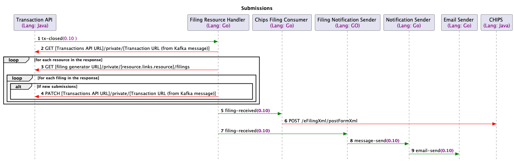

# Filing Resource Handler Java

## Overview

This service handles updating the transaction resource with a list of filings after the transaction has been closed and starts the processing of the transaction.

The diagram below shows how the filing-resource-handler-java is used in the journey.

## Requirements

In order to run the service locally you will need the following:

- [Java 21](https://www.oracle.com/java/technologies/downloads/#java21)
- [Maven](https://maven.apache.org/download.cgi)
- [Git](https://git-scm.com/downloads)

## Getting started

To checkout and build the service:

1. Clone [Docker CHS Development](https://github.com/companieshouse/docker-chs-development) and follow the steps in the
   README.

These instructions are for a local docker environment.

## Configuration

| Variable | Description | Example (from docker-chs-development) |
|----------|-------------|---------------------------------------|

# Error Handling

## Design

[design](./docs/design/readme.md)

## Testing

[Testing](./docs/testing/readme.md)
