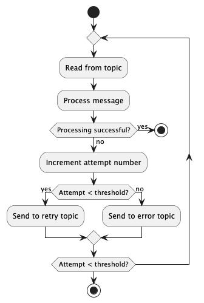
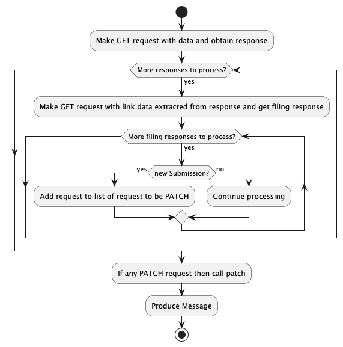

# Filing Resource Handler Java - Detailed Design Document

## Overview

The Filing Resource Handler processes `transaction-closed` messages from a Kafka topic and updates transaction records
accordingly. This document details:

- Service architecture
- Main classes and responsibilities
- Business logic and message flow
- Error handling
- Configuration and environment

---

## Main Classes and Responsibilities

- **Consumer**: Listens to Kafka, receives messages, and delegates processing.
- **Producer**: Send Message to configured Topic.
- **FilingResourceHandlerService**: Orchestrates the end-to-end processing of transaction-closed messages,including
  transaction retrieval, resource processing, patching, and message publishing.
- **FilingResourceProcessorService**: Processes transaction resources, retrieves filing data, prepares filings to patch,
  and collects items for further processing.
- **FilingPatchService**: Adds a Filing object to a map for patching a transaction, handling special cases for
  insolvency filings.
- **SubmissionIdService**: Determines the highest submission ID offset in a transaction and builds a matcher map for
  existing filings.
- **ItemService**: Serializes filing data and adds a Transaction item to a list, handling JSON errors as retryable
  exceptions.
- **FilingFactory**: Creates a Filing object for patching a transaction using data from FilingApi, company number, and
  resource links.
- **FilingReceivedFactory**: Builds a FilingReceived message from transaction and item data, handling company info
  extraction and error cases.
- **ItemFactory**: Constructs a Transaction item for a filing, setting its data, kind, submission ID, and language.
- **ResourceMapFactory**: Generates a filtered map of transaction resources based on filing mode, ensuring correct
  resource selection and error handling.
- **TransactionsApiClient**: Handles PATCH and GET requests to the Transactions API.
- **FilingClient**: Retrieves FilingApi data from a remote service using WebClient, handling errors and query parameters
  for resource, company name, and company number.
- **MessageFlags**: Manages retryable flags for error handling.
- **Custom Exceptions**: `RetryableException`, `NonRetryableException`, `InvalidPayloadException`,
  `UnexpectedRequestResponse` for error categorization.

---

## Architecture

### Key Components

1. **Kafka Consumer**:
    - Listens to a configured topic for `transaction-closed` messages using Spring Kafka.
    - Supports retry and error topics for resilience.
2. **Kafka Producer**:
    - Used for publishing messages to a configured topic `filing-received`.
3. **Processing Services**:
    - Transform information from Transaction and Filing APIs to create a messages and to update transactions.
4. **Filing API Integration r**:
    - Sends GET requests to the various kinds of API Endpoint using a custom `FilingClient` .
5. **Transactions API Integration**:
    - Sends GET and PATCH requests to the Transactions API using a custom `TransactionsApiClient`.
6. **Resilience/Retry Handler**:
    - Manages transient errors and retries using Spring Retry.

---

## Diagrams

---

## Message Processing Flow

### 1. Message Consumption

- The service consumes messages from the Kafka topic using Spring Kafka's `@KafkaListener` annotation.

### 3. Deserialize Message

- The message is deserialized into a `transaction_closed` Java object. (The exact serialization format is handled
  elsewhere.)
- **Error Handling**: If deserialization fails, the error is logged, and the message is sent to the error topic.

### 4. Transform the message

- Retrieves the transaction from the Transactions API using the provided transaction URL.
- For each resource in the transaction, fetches associated filings from the Filing API.
- Determines unique submission IDs for each filing and prepares a patch map for transaction updates.
- Serializes filing data and adds items to a list for downstream processing.
- Handles special cases, such as insolvency filings, by adjusting the company number as needed.
- Applies transaction patches via the Transactions API if new filings are found.
- Implements robust error handling: logs and throws retryable exceptions for transient errors, ensuring failed
  messages are retried or sent to the appropriate Kafka topic.
- **Error Handling**:
    - Logs and throws `RetryableException` for recoverable errors (e.g., empty responses, invalid offsets).
    - Ensures that deserialization and API call failures are handled according to the service's resilience strategy.
- **Integration Points**:
    - Depends on `TransactionsApiClient`, `FilingClient`, `TransactionFactory`, and `ResourceMapFactory` for its
      operations.
    - Interacts with Kafka indirectly via upstream and downstream service orchestration.

### 5. Message Production

- The service produces messages for Kafka topic `filing-recieved` using send template.

### 6. Shutdown

- The service gracefully shuts down, ensuring all resources (e.g., Kafka consumer/producer) are closed.

---

### Error Handling

- **Deserialization Errors**:
    - Logged and sent to the error topic.
- **API Call Failures**:
    - If the resource is not found
    - Other errors are logged and sent to the retry topic.
- **RetryableException**:
    - Includes HTTP responses (excluding 400 & 409) and deserialization errors like `InvalidPayloadException`.
- **NonRetryableException**:
    - Includes 400 and 409 HTTP responses, and URI validation exceptions.

---

## Configuration

### Kafka Topics

- **Consumer Topic**:For normal/valid message processing.
- **Retry Topic**: For transient errors.
- **Error Topic**: For unrecoverable errors.
- **Producer Topic**: For sending message.

### Environment Variables

| Environment Variable              | Description                                        | Example/Default Value   |
|-----------------------------------|----------------------------------------------------|-------------------------|
| BOOTSTRAP_SERVER_URL              | Kafka broker address                               | localhost:9092          |
| RETRY_MAX_ATTEMPTS                | Maximum retry attempts for message processing      | 5                       |
| RETRY_BACKOFF_DELAY_MS            | Delay (ms) between retry attempts                  | 1000                    |
| CONCURRENT_LISTENER_INSTANCES     | Number of concurrent Kafka consumer instances      | 1                       |
| FILING_RECEIVED_TOPIC             | Kafka topic to send processed filings              | filing-received         |
| TX_CLOSED                         | Kafka topic to receive transaction-closed messages | tx-closed               |
| GROUP_ID                          | Kafka consumer group ID                            | filing-resource-handler |
| CHS_INTERNAL_API_KEY              | Internal API key for service calls                 | default_api_key         |
| CHS_INTERNAL_API_URL              | Internal API base URL                              | http://localhost:8889   |
| TIMEOUT_MILLISECONDS              | Timeout for API calls in milliseconds              | 0                       |
| OAUTH2_CLIENT_ID                  | OAuth2 client ID                                   | client                  |
| API_LOCAL_URL                     | Local API base URL                                 | http://localhost:8889   |
